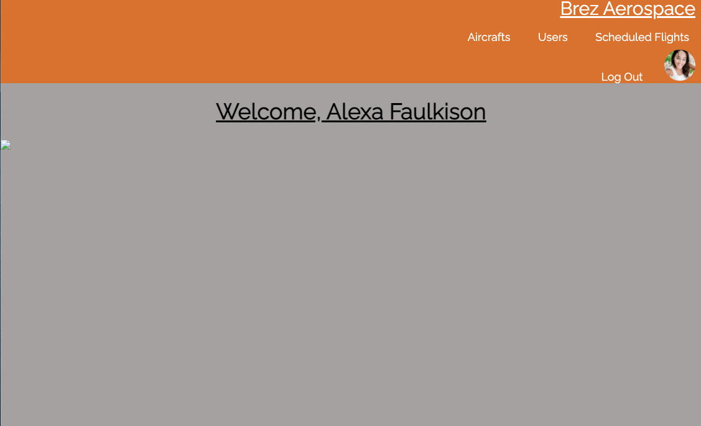
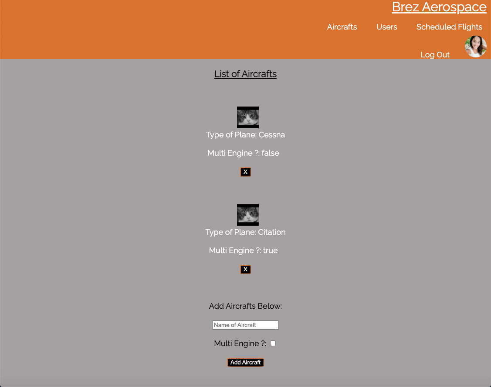
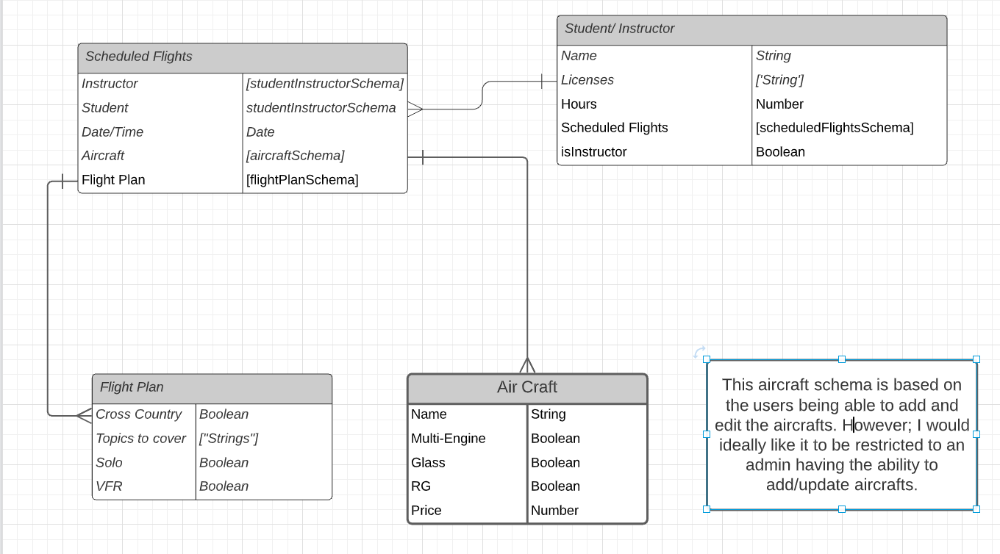
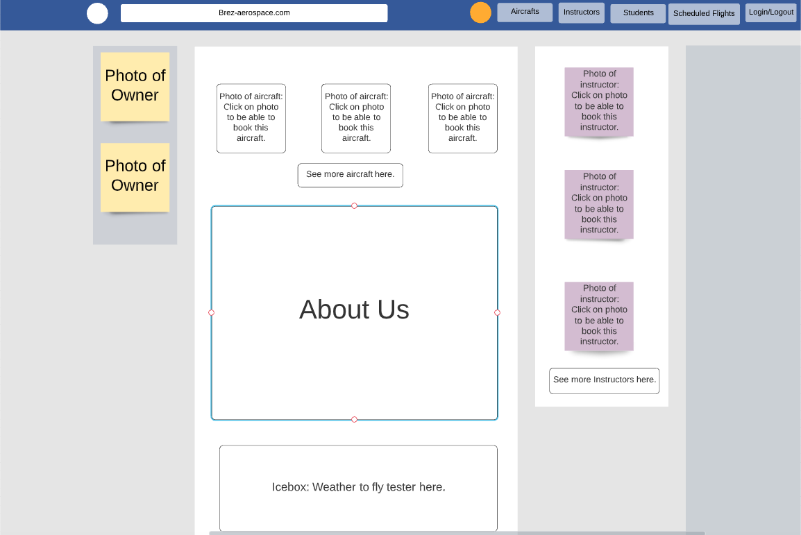

# Flight-Scheduler

### Getting Started:

[Brez Aerospace!](https://scheduled-flights.herokuapp.com/)

[Trello](https://trello.com/b/pBsZubW9/flight-schedule)

This app is a sight for a flight school to allow students and instructors to add, update and delete flights for flight training. They can view the different aircrafts that are available and can select the instructor and the plane they will be using. They can input and update their profile with the latest hours, licenses and ratings they have achieved as well. 

### Screenshots of deployed app:
#### Main Page:

#### Aircrafts Page:

### ERD: 

### Wireframe:

### Biggest Challenges

My biggest challenges were letting go of features that were above and beyond what could have realistically been accomplished. I spent a lot of time debugging and trying to figure out how to implement features that were outised of the requirements and I should have focused on scaling my project back and making sure the basic features were functioning how I wanted them to. After reworking my schemas and setting a more realistic goal, I became stumped and challenged by the way I should organize and work my schemas and which items needed to be referenced. Finally, the styling came as a challenge for me because I have a mental block when it comes to styling. I do not enjoy styling very much and I create an invisible mountain over something so small. I want to become more proficient in CSS and styling, so it doesn't seem so overwhelming. 

### Technologies Used:

* HTML/EJS
* CSS
* JavaScript
* Node.js
* Mongoose
* MongoDB
* Azure
* LucidChart
* Google
* Heroku
* [GitHub](https://github.com/Looloo414/flight-scheduling)

### Ice Box Features

The main adjustments I want to make are authorization conditions. I want an admin, and instructor and a student all to have different capabilities when it comes to operating the website. The admin will be the only users that can add, delete or edit available aircrafts. The admin will also have full authority to delete, edit or create schedules and add any students or instructors that are applicable. Instructors and students will have similar capabilites, but their profiles will look different that one another. 

I also want to implement conditions where a single instructor and a single aircraft cannot be booked at the same time and a notification will signal the user that the instructor or plane is unavailable at that time. 

There are added features, such as contacting instructors or admin through a "request more information" form. I would also like to learn how to turn the user's email into a link that would allow the logged in user to send someone a personal email. 

Finally, I want to update the styling and make it more acssesble friendly and more appealing design-wise. 
